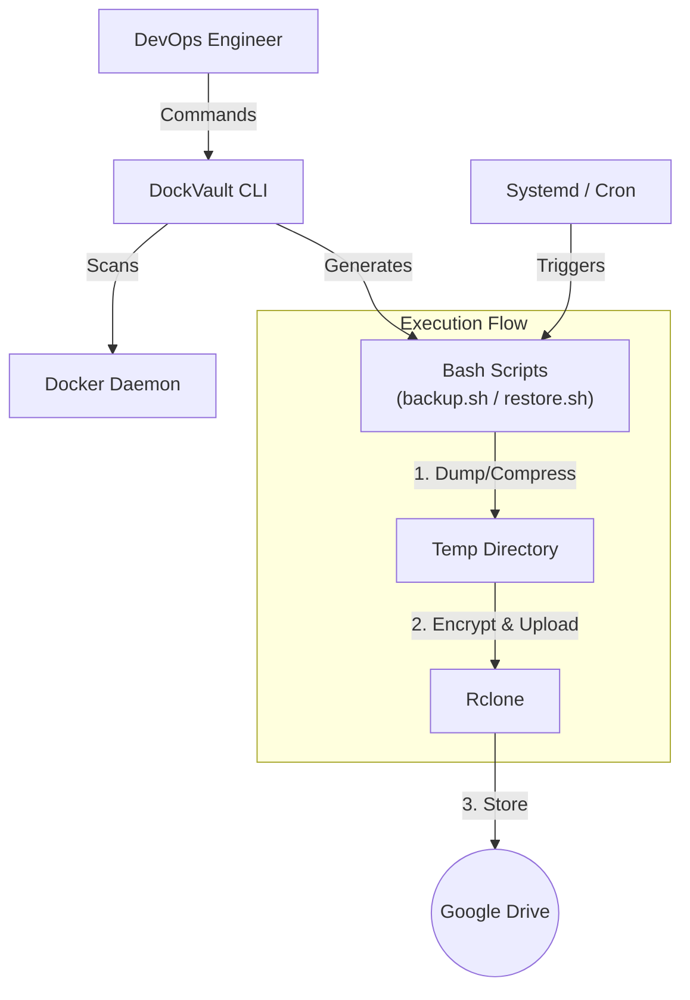

# DockVault 🐳 🔒

**DockVault** is a robust, modular Command Line Interface (CLI) tool designed to automate the backup of Docker Volumes to Google Drive. It implements **Infrastructure as Code (IaC)** principles to turn fragile, manual backup processes into resilient, automated workflows.

Built during my **Student Industrial Internship at ERS Energy Sdn Bhd**, this tool secures critical production data against hardware failure and corruption.

-----

## 📖 Table of Contents

  - [The Story: Why DockVault?](https://www.google.com/search?q=%23-the-story-why-dockvault)
  - [Key Features](https://www.google.com/search?q=%23-key-features)
  - [Architecture](https://www.google.com/search?q=%23-architecture)
  - [Prerequisites](https://www.google.com/search?q=%23-prerequisites)
  - [Installation](https://www.google.com/search?q=%23-installation)
  - [Quick Start Guide](https://www.google.com/search?q=%23-quick-start-guide)
  - [Scheduling (Automation)](https://www.google.com/search?q=%23-scheduling-automation)
  - [Recovery](https://www.google.com/search?q=%23-recovery)

-----

## 💡 The Story: Why DockVault?

In the fast-paced world of DevOps, data persistence is often the "silent risk."

During the first half of my internship, our department faced a critical hardware failure where a production server's CPU overheated and failed. While the hard drives survived, the incident exposed a terrifying reality: **we relied on local persistence.** Had the drives failed, months of Prometheus metrics, Grafana dashboards, and PostgreSQL records would have been lost.

Existing open-source backup scripts were often:

1.  **Too Generic:** Lacking context-aware logic (e.g., treating a database volume the same as a static file volume).
2.  **Brittle:** Relying on hard-coded paths and complex Cron edits.
3.  **Hard to Maintain:** Scattered across multiple scripts and terminals.

**DockVault** was born to solve this. It provides a unified interface to scan, secure, and automate backups off-site to Google Drive, ensuring business continuity.

-----

## ✨ Key Features

  * **🔍 Smart Volume Scanning:** Automatically detects Docker volumes and maps them to running containers.
  * **🧠 Context-Aware Templates:**
      * **Standard:** `tar` compression for file-based volumes (e.g., Nginx, Configs).
      * **PostgreSQL:** Performs `pg_dump` inside the container before backup to ensure data consistency.
      * **MySQL:** Performs `mysqldump` to prevent corrupted tables.
  * **☁️ Cloud Native:** Seamless integration with **Google Drive** via Rclone.
  * **🛡️ Retention Policy:** Automatically prunes backups older than 30 days (configurable).
  * **🤖 Automated Scheduling:** One-command setup for Systemd Timers (Linux) or instructions for Windows Task Scheduler (WSL).
  * **♻️ Disaster Recovery:** An interactive "Restore Wizard" that lets you browse remote backups and restore them with a single click.

-----

## 🏗 Architecture



-----

## 🛠 Prerequisites

Before installing DockVault, ensure your system has the following dependencies:

1.  **Docker:** (Obviously\!)
2.  **Rclone:** Used for cloud uploads.
    ```bash
    sudo -v ; curl https://rclone.org/install.sh | sudo bash
    ```
3.  **Basic Utilities:** `tar`, `gzip`.

### Important: Configure Rclone

DockVault expects an Rclone remote named `dockvault_backup` (default).

1.  Run `rclone config`
2.  Create a new remote named `dockvault_backup`
3.  Select `drive` (Google Drive) and follow the authentication steps.

-----

## 📥 Installation

### Option 1: Build from Source (Recommended)

Since this project uses the **Bashly** framework, you can compile the latest version yourself.

1.  **Clone the repository:**

    ```bash
    git clone https://github.com/kreee00/dockvault.git
    cd dockvault
    ```

2.  **Install Bashly (Ruby required):**

    ```bash
    gem install bashly
    ```

3.  **Generate and Install:**

    ```bash
    bashly generate
    chmod +x dockvault
    sudo mv dockvault /usr/local/bin/dockvault
    ```

4.  **Verify:**

    ```bash
    dockvault --help
    ```

-----

## 🚀 Quick Start Guide

### 1\. Scan your Volumes

See what volumes are available on your host.

```bash
dockvault scan
```

### 2\. Generate a Backup Job

Run the wizard to create a dedicated backup script for a specific volume.

```bash
dockvault generate
```

  * Select the volume.
  * Choose the template (Standard, Postgres, or MySQL).
  * Enter database credentials (if applicable).
  * Set the upload path (e.g., `backups/production`).

### 3\. Run a Manual Backup

Test the script immediately.

```bash
dockvault backup
# Select the volume you just configured
```

### 4\. Verify on Cloud

Check the files in your Google Drive without leaving the terminal.

```bash
dockvault tree --detailed
```

-----

## ⏰ Scheduling (Automation)

DockVault creates a `master_backup.sh` that orchestrates all your generated jobs.

### For Linux Servers (Systemd)

We use Systemd timers for reliability and logging.

```bash
# Install and enable the timer (Daily at 3:00 AM)
dockvault schedule --install

# Check status
dockvault schedule --check
```

### For Windows Subsystem for Linux (WSL)

Systemd/Cron does not run reliably in the background on WSL. Use **Windows Task Scheduler**.

1.  Open **Task Scheduler** in Windows.
2.  Create a **Basic Task** (Daily).
3.  **Action:** Start a Program.
4.  **Program:** `wsl.exe`
5.  **Arguments:**
    ```text
    -u <YOUR_USERNAME> bash /home/<YOUR_USERNAME>/dockvault_scripts/master_backup.sh
    ```

-----

## ♻️ Recovery

Disaster struck? DockVault makes restoration easy.

```bash
dockvault restore
```

1.  Select the volume you need to fix.
2.  The tool connects to Google Drive and lists all available backup archives (sorted by date).
3.  Select the file number.
4.  Type `RESTORE` to confirm.

*The tool will automatically download, unzip, and stream the data back into the volume or database container.*

-----

## 📄 License

This project is licensed under the MIT License - see the [LICENSE](https://www.google.com/search?q=LICENSE) file for details.

-----

Made with ❤️ by [Akram Faisal](https://github.com/kreee00) for the Student Industrial Internship Project 2025 at ERS Energy.
